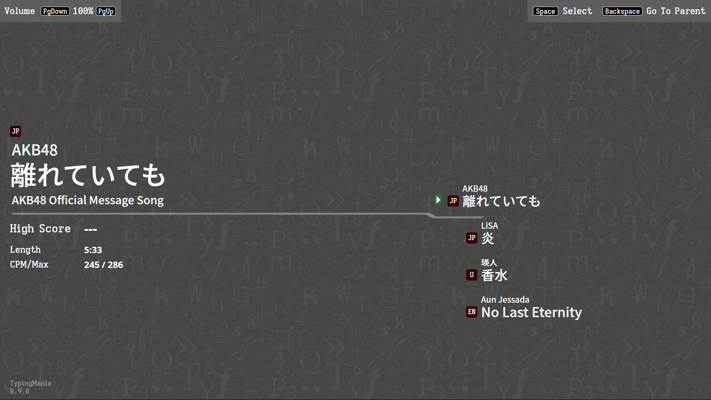
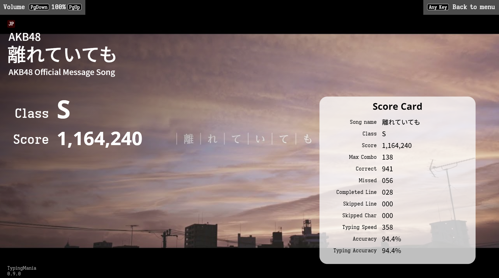

TypingMania NEO
===============

TypingMania is a song lyric typing game. You can also think of it like
Karaoke, but typing version.

**You can play at https://typingmania.stdlib.xyz**

You can also contact me at typingmania (at) stdlib (dot) xyz.

### Highlighted features

- YouTube playback ability
- Japanese lyric lines are more natural (Kanji & Furigana)
- Typing sound feedback
- Can load local song files

### Roadmap

- Visual editor for song

Table of Content
----------------

- [How to Play](#how-to-play)
- [Creating New Song](#creating-new-song)
- [Score Calculation](#score-calculation)
- [Supported Browser](#supported-browsers)
- [History](#history)
- [Project Structure](#project-structure)
- [Installation & Building](#installation--building)
- [File Format](#file-format)
- [License & Copyright](#license--copyright)
- [日本語](#日本語)

How to Play
-----------

This game is controlled purely by a keyboard (because it is a typing game).
There is no mouse interaction available.

### Selecting song

**Top-Left** is the master volume control. Use the `PageUp` and `PageDown` keys
to change the volume level. Note that for YouTube, the volume is only 
approximated.

**Right** part of the screen is the song list. It shows the artist and song 
title. The square shows the song language, while the color denotes the media
type:

- **Red** (shown in the picture) means YouTube media.
- **Green** means a video file.
- **Blue** means audio-only.

**Left** part shows song detail. It includes artist, song title, song subtitle,
current high score, the song length. It also shows the character-per-minute
of the song, at 90 percentile and the maximum. This can be used to gauge
the difficulty of the song.

To navigate the menu, use `Up Arrow` and `Down Arrow`. To enter a collection or
select a song to play, use `Enter`. To exit collection, use `Backspace`.

#### Using local file

You can drag and drop a valid `.typingmania` file to the game to load. In this
case, the high score is keyed by the file name.

#### Automatic song selection

If you want the game to load and go straight to a specific song skipping the 
menu, please pass the query string `song={file_url}` to the game, where 
`file_url` is the relative path to the `.typingmania` file to load. The game 
will immediately load the song provided.

### Typing

Basically, just type what is on the screen. You can press `Esc` at any time to
finish the song early.

You can use the `Tab` button to skip any line. Note that if you skipped a lyric
that you have not finished typing yet, it will be counted as *skipped*.

The **Total** progress bar shows the progress within the song. The **Line**
progress bar shows the current progress within the line.

For the Japanese line, even though the shown Romaji might be different, the 
system supports almost every possible keypress sequence that will result in 
that Kana. For example, にゃ can be input as *nya*, *nixya*, and *nilya*. 
いっしょ can be input as *issho*, *ixtsusho*, *ixtushixyo*, etc.

### Score

After the song ended (or `Esc` was pressed), the score summary screen will be
shown with the following number:
- **Score/Class**: Refer to [Score calculation](#score-calculation) section.
- **Max Combo**: maximum number of consecutive correct keypresses.
- **Correct**: number of correct keypresses.
- **Missed**: number of incorrect keypresses.
- **Completed Line**: number of lines completed.
- **Skipped Line** number of lines that were not completed (unable to finish
  typing within the time)
- **Skipped Char**: number of characters unable to finish within the time.
- **Accuracy**: your accuracy.
- **Typing Accuracy**: typing accuracy if the skipped char is counted as 
  missed.
  
### Game modes

Game mode is a hidden feature. You can cycle game mode in the menu screen using
`F9` key. It will cycle between these modes:

- **Normal** Normal game mode. Default. No indications.
- **Easy** In easy mode, if you have not finished typing the line when the
  time is up, the line will repeat itself until you finish typing.
- **Tempo** Just push any key, it will be considered as a correct key.
- **Auto** Automatic typing. Sit and watch. Note that this does not block the
  input, so you can still mess up the score by also trying to type in this mode.
- **Blind** Only the next character to type is visible. The lyrics line and
  other typing characters are not visible.
- **Blank** Similar to blind, but furthermore, the next character to type is also
  invisible. Line interval are also not provided. Score information, including
  the number of correct line and skipped character, is visible. Sound feedback
  is also not changed.

NOTE: Playing any game mode other than **Normal** will not save the high score
for that play.

Creating New Song
-----------------

### Before you begins

Prepare the following:

- **Song media.** Can be audio, video, or YouTube video. For raw audio/video,
  the guaranteed format is mp4 (H.264/AAC) for video, and mp4 (AAC) or mp3
  for audio. For YouTube video, it is recommended to also download the video 
  anyway (using a program like `youtube-dl`) to facilitate lyric timing.
- **Song lyric.** For English, just the lyric itself is usually okay. Make sure
  to check for any non-typeable characters and remove them beforehand. For
  Japanese, see below.
- **Song image.** This image is used as a preview image, and also background
  image during loading/score screen. Can be in any major format.

#### Preparation of Japanese song

Japanese song lyrics required some preparation. Reading is required for
all Kanji in the lyrics.

The system will recognize hiragana/katakana characters and punctuations,
but will require reading for Kanji.

Punctuations like 「」【】 will be removed automatically from typing.
。、… etc. will become . , ... respectively. For Kanji, use [] to specify
the reading. For example,

    強くなれる理由を知った 明日へ

should become:

    強[つよ]くなれる理[り]由[ゆう]を知[し]った 明日[あした]へ

Half-width space will require spacebar input during typing, but full-width
space will be skipped automatically. Moreover, putting `|` character will
create a little spacing in the typing romaji line to ease readability.

If you want to specify reading for hiragana/kanataka directly, use `<< >>`
for example:

    今[いま]でも生[い]きている<<ストーリーズ>>[Stories]

You can also use `<<text>>[]` to make some part of lyrics non-typable.

### Using the visual editor

*Visual editor is currently in development*

### Using command line

You will need `nodejs`, *Aegisub* (or other programs that can edit .ass file),
a text editor, and a basic understanding of the command line to create a song 
this way. You also need `ffmpeg` somewhere in your path.

The `.ass` file to be converted requires the following in **Actor** field:

- `Title` Song title. `{native_script} // {latin_script}`. Note that the Latin 
  script is currently not used. If the native script is already in Latin, 
  omitted the `//`.
- `Subtitle` Same format.
- `Artist` Same format.
- `Image` File name of song image. Must be in the same folder as the subtitle 
  file.
- `Audio` or `Video` or `YouTube` Audio/Video file, or YouTube Video ID.
- `Language` Lyric language. 2-letter, e.g. EN, JP, etc.
- `Lyrics` These are typing lines.

Other than the lyrics line where the timing information is used, the other 
lines can be at any time. For Aegisub timing guide, see
https://unanimated.github.io/timing-basics.htm. Note that lead-in, lead-out,
scene-bleed, etc. do not apply here.

Finally, run:

    node /path/to/build-all-songs.js

This will convert all `.ass` files in the current working directory, as long
as any in the sub-folder, to `.typingmania` files, ready to be played.

If the program returned an error, you likely missed some Kanji
reading in the lyrics.

The example data also includes the original `.ass` file.

### Building song index

If you are playing by yourself, you do not need to build the index.
Refer to [Using local file](#using-local-file) section to play your song
locally.

You can also send the resulting `.typingmania` file to other people to play
without needing a song index too.

For setting up your own TypingMania instance, you need to build a song index,
typically `songs.json`, for the game to know what songs are available.

The easiest way to do this is to create the structure inside `data/` folder
to the structure you wanted. Then, do:

    npm run build-index

This will automatically create an index file `songs.json` with the same
structure as `data/` folder.

To have more control over a collection name, you can create `info.txt` inside
the folder. The first line of the file will be used as a collection name,
and the rest will be the collection description.

Refers to [File format](#file-format) section for specific format of
`songs.json` index file.

Score Calculation
-----------------

Each character in the song lyrics contains a concept of *scoring characters*.
For Latin characters, the *scoring character* is always 1. For Japanese,
however, this is different. For example, ち may be typed as ti and chi,
but the *scoring character* is always 2. It is always the number of
the shortest possible sequence of keypresses to input that character.

All keypresses up to the *scoring character* are used for score
calculation. All further keypress will also be used to calculate
typing speed, but cannot generate any positive score.

For each correct keypress, the score is calculated as
`1000 + CPM Bonus + Combo Bonus`. CPM Bonus is calculated as
`Current Average CPM * 0.25`, and Combo Bonus is just the current combo
chain.

For each incorrect key press, a penalty of 500 points is applied. Note that
this only applies where a lyrics line is active. Extra keypress while waiting
will not generate penalties.

Furthermore, there is also a line bonus. If you can finish a lyrics line,
then you get 10% of the score you gained during that line. If you can
finish the line without any mistake, you gain another 15%.

### Score Class

Classes are award based on the score relative to the base score. The base score
is calculated by: `number_of_char × 1250`, where `number_of_char` refers to the
*scoring character*, or the minimum number of characters required to
complete the song.

Score ratio for each class

| Percent  | Class |
| -------- | ----- |
|   > 125% |   SSS |
|   > 110% |    SS |
|   > 105% |    S+ |
|   > 100% |     S |
|    > 95% |    A+ |
|    > 90% |     A |
|    > 85% |    B+ |
|    > 80% |     B |
|    > 75% |    C+ |
|    > 70% |     C |
|    > 60% |    D+ |
|    > 50% |     D |
|    > 40% |    E+ |
|    > 30% |     E |
|    > 20% |    F+ |
|    < 20% |     F |

REFERENCE: TypingMania ODYSSEY Score Calculation

The original SightSeeker Studio's TypingMania ODYSSEY score calculation is
very simple. The maximum score is 200,000, and each correct keypress gain you
`200,000 ÷ scoring character`. Each incorrect keypress loss you half of the
gain (`-0.5 * (200,000 ÷ scoring character)`).

Possibly due to a bug in character count calculation, it is possible to get 
more than 200,000 points by always typing the longest romaji of each character.

The combo does not affect the score at all.

Supported Browsers
-----------------

- The latest version of Google Chrome and Mozilla Firefox.
- Untested on Microsoft Edge, but should work.
- Safari has a delay between the actual and reported media time,
  resulting in a slight (but noticeable) delay of the lyrics line.

History
-------

Back in 2013, I made a TypingMania Odyssey clone in JavaScript, which is
available in the `master` branch.

That version of TypingMania was almost a direct clone of TypingMania ODYSSEY,
except for the score calculation system which I did not reverse-engineer
at that time.

I have been trying to rewrite this project since 2016, but this attempt in
2020/2021 is the first successful attempt. This comes after a lot of
advancements in HTML5 technologies, including Web Audio API, HTML5 Video,
and ES6 module.

The current TypingMania NEO is a pure HTML5 and JavaScript program. No
external libraries were used. The editor, however, uses the Preact library.

The Japanese Kana input system is extensively tested using unit tests.

### Different from TypingMania ODYSSEY

- It is written in HTML5 (HTML+JS), so it runs in 2021 after Adobe dropped
  Flash support in December 2020.
- Revamp UI, including changes to correct terminology: Solve -> Skipped,
  Corrected Percent -> Accuracy, etc. Also include split progress bar for song
  total time.
- New score calculation algorithm (see [Score calculation](#score-calculation))
- Maybe better Japanese handling. This version accepts almost all Romaji
  sequences that result in the same sentence.
- No longer differentiate between lyrics and typing line. *Furigana* must be
  added to Kanji lyrics. Most other symbols are converted automatically to
  typable text.
- Add sound effect for typing/missed/skipped line.
- Can skip line using `Tab` key.
- Can load a local file.
- **Can load the video directly from YouTube**

### Different from original TypingMania

- Different score calculation.
- No auto-play mode.
- Better performance. This is much faster than the older version.
- Since the original TypingMania was an ODYSSEY clone, all ODYSSEY differences
  also apply.

Project Structure
-----------------

- `assets/raw` folder contains the actual assets file used.
- `assets/assets.dat` is a packed assets file. This can be generated with
  `npm run build-assets`
- `data/songs.json` is the main song index file. I suggest putting all songs 
  file (.typingmania) under this folder, but it is not required.
- `docs` contains documentation-related material.
- `latin-table` is a folder containing transliterating table for the game.
  Check `README` in that folder for more detail.
- `scripts` contains nodejs scripts for processing game media, etc.
- `src` is the main source code folder.

Installation & Building
-----------------------

Note that this game can runs directly from the source code folder. The
`index.html` file in the project root is a full game by itself. However,
it might not be suitable for production releases because it loads multiple
javascript files.

To get a production-ready file, either download from the ~~GitHub releases page~~ *not available yet*
or build from the source code below.

In the `index.html` file there are two configurable parameters: `assets_url`
and `songs_url`. `assets_url` refers to the path to the `assets.dat` file, and 
the `songs_url` refers to the song index file, both relative to the 
`index.html`.

The recommendation is to create a `data/` folder and put the index file
`songs.json` along with other `.typingmania` files there, but it is not
required, and you can put it however you want. Noted that URLs inside
`songs.json` are also relative to `index.html`.

This game can be hosted on any web server capable of serving static files.

### Building from source

To build the game, run:

    npm run build-game

This will create a `dist/` folder containing files suitable for distribution.

If you make a change to the assets file, you can rebuild the `assets.dat` by:

    npm run build-assets

Note that the `build-game` command does not rebuild assets. Run `build-assets`
before `build-game` to build a redistributable file with new assets.

File Format
-----------

### `.typingmania` file format

`.typingmania` is a binary file in a RIFF format. It is basically a very
simple archive. It contains 2 chunks: `LIST` and `FILE`.

#### `.typingmania` RIFF

| Byte range | Type  | Description                   |
|------------|-------|-------------------------------|
| 0-3        | 4CC   | 'TPMN' file signature         |
| 4-7        | u32le | Total file length - 8         |
| 8-11       | 4CC   | 'LIST'                        |
| 12-15      | u32le | Number of file in the archive |
| 16+        |       | `<<file_entry>>`              |
|            | 4CC   | 'FILE'                        |
|            | bin   | File contents                 | 

#### `<<file_entry>>`

| Byte range  | Type  | Description           |
|-------------|-------|-----------------------|
| 0           | u8    | Length of file name   |
| 1-(n+1)     | str   | File name (UTF-8)     |
| (n+1)-(n+4) | u32le | Offset to the start of this file in the archive | 
| (n+5)-(n+8) | u32le | File length           | 

### `song.json` file format

This is a standard JSON file encoded in UTF-8. It contains the following
fields:

- `title`: Title in song native language
- `latin_title`: Title in Latin alphabet (currently not used)
- `subtitle`: Subtitle in song native language
- `latin_subtitle`: Subtitle in Latin alphabet (currently not used)
- `artist`: Artist in song native language
- `latin_artist`: Artist in Latin alphabet (currently not used)
- `language`: Lyrics language. 2 letter format. (e.g. EN, JP, etc.)
- `cpm`: Character per minute of the lyric line, 90 percentile
- `max_cpm`: Character per minute of the lyric lines, maximum
- `duration`: Song duration, in second
- `image`: Image file name in the same `.typingmania` archive
- Media file specification. Must have one of the below:
  - `audio`: Audio file name in the same `.typingmania` archive
  - `video`: Video file name in the same `.typingmania` archive
  - `youtube`: YouTube Video ID

### `lyrics.csv` file format

This is a CSV file containing lyrics and timing information. The line
format is `{start_time},{end_time},{lyric}`. The file must be encoded
in UTF-8.

- `start_time` is the line start time, in millisecond.
- `end_time` is the line end time, in millisecond.
- `lyric` is the lyric (typing).

The line must be sorted, by `start_time` and there must not be any overlap
between each line.

### `songs.json` file format

This is a standard JSON file encoded in UTF-8. It contains an array of songs
or song collections.

#### `song` object

Basically the same as `song.json` format, except also has the `url` property
to specify the URL to the `.typingmania` file (relative to `index.html`).

#### `song collection` object

- `type`: Must be "collection"
- `name`: Collection name
- `desciption`: Collection description
- `contents`: Array of songs or song collections.

License & Copyright
--------------------
The code and assets are copyrighted under the term of the Apache 2.0 license.

This game uses
[Dustyroom Casual Game Sound - One Shot SFX Pack](http://dustyroom.com/free-casual-game-sounds/).

This game also uses the Iosevka Etoile, Noto Sans CJK JP, and Open Sans fonts.
Iosevka font family is licensed under SIL Open Font License. Noto Sans and
Open Sans font families are licensed under the Apache 2.0 License.

When creating a song to use with the game, make sure you have the proper right
to the video/audio used. TypingMania NEO and its developer does not take
responsibility for managing the copyright of any content used by the user.

日本語
------
TypingMania NEOは歌の歌詞に合わせてタイピングするタイピングソフトです。元々のTypingMania ODYSSEYはSightSeeker Studioによる開発し、残念ながら2009年に開発中止しまいました。SightSeeker StudioのTypingManiaはAdobe Flashで開発しました。

2013年に、私はHTML5によるTypingManiaのパクリのソフトを開発し、2021年にこのTypingMania NEOを完成しました。HTML5でどんなブラウザにもプレイをでき、YouTubeの音源としても利用できるようにしました。2020年をもってAdobe Flashサポート終了を伴い、TypingMania ODYSSEYはプレイできなくなり、TypingMania NEOを誕生しました。

### 対応ブラウザ
- 最新型のGoogle Chrome, Mozilla Firefox
- Safariの音声はちょっと遅れて、歌詞のタイミングが合わない場合が多い。

